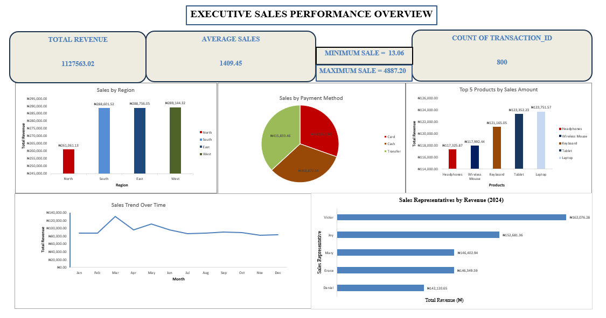
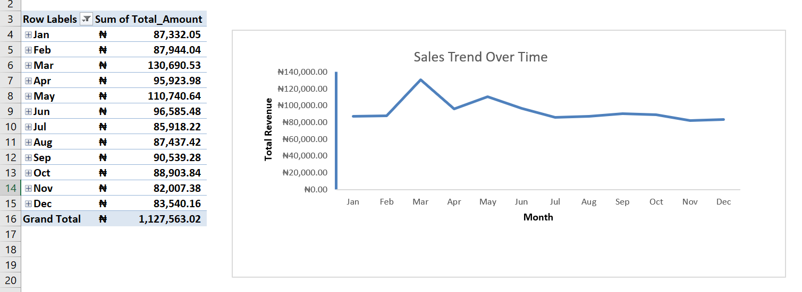
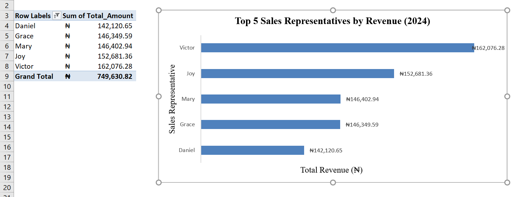
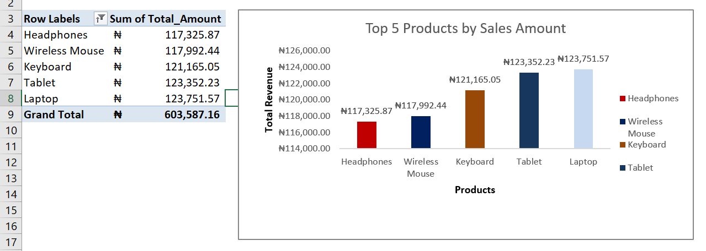
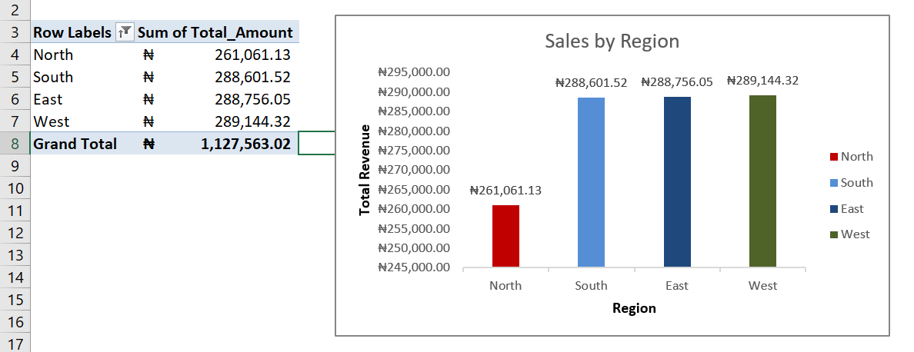

# Executive Sales Performance Dashboard

**Capstone Project by Matilda Oluwadarasimi Adeyemi** Interactive Excel dashboard analyzing 800+ retail sales transactions (2024)

## 📊 Project Overview
Processed and cleaned an 800-record sales dataset in Excel.  
Built interactive dashboards using PivotTables and PivotCharts to visualize key performance data.

## 💡 Key Insights
- Monthly revenue trends across 2024
- Top-performing region and its contribution
- Top 5 Sales Representatives by revenue
- Best-selling product categories

## 📁 Files in this Repository
- **Executive Sales Performance Dashboard.xlsb** ← Main interactive Excel file (Download to view)
- Screenshots of all dashboards

## 🖼️ Dashboard Screenshots

## 🛠️ Tools Used
- Microsoft Excel (PivotTables, PivotCharts, Data Cleaning, Data Visualization)

*Built in March 2026 | For Data Analyst & BI Internship applications*

---
**Matilda Oluwadarasimi Adeyemi** LinkedIn: [linkedin.com/in/matilda-adeyemi-903504215]  
Email: adematilda22@gmail.com
